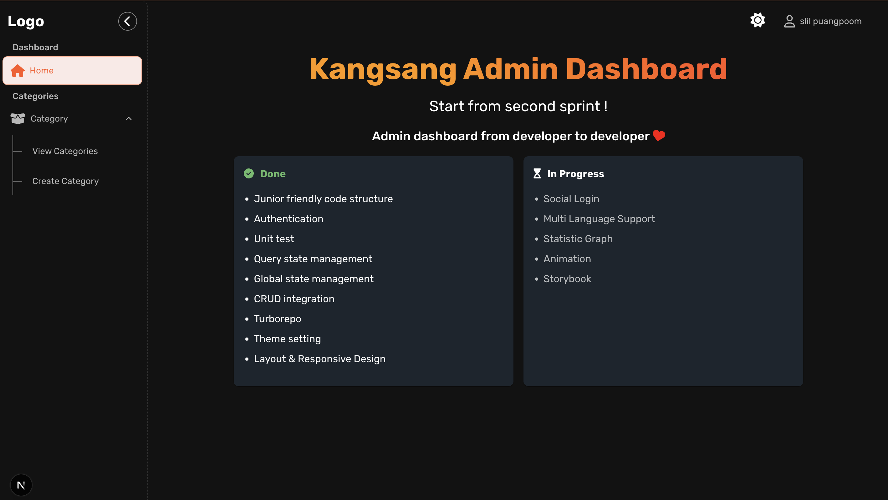

# Kangsang Web

A modern, developer-friendly boilerplate built with Next.js, TypeScript, and Turborepo. This project provides a solid foundation for building scalable with best practices and modern tooling.

## 🚀 Example project (Admin Dashboard)



## 🔗 Demo

Check out the live demo: [Kangsang Web Demo](https://kangsang-admin-web.vercel.app)

## 🛠️ Tech Stack

- Next.js (App Router)
- TypeScript
- Turborepo
- Material-UI (Customized as Kangsang-MUI)
- NextAuth.js
- TanStak Query
- Redux
- Vitest (unit test)

## 🚀 Getting Started

1. Clone the repository:

```bash
git clone https://github.com/slilp/kangsang-web.git
cd kangsang-web
```

2. Install dependencies:

```bash
pnpm install
```

3. Start the development server:

```bash
pnpm dev
```

4. Open your browser and navigate to `http://localhost:3000`

## 📁 Project Structure

```
kangsang-web/
├── apps/
│   ├── kangsang-admin/     # Admin dashboard
├── packages/    # Shared packages
│   ├── kangsang-mui/  # Share components
└── package.json
```

## 🔧 Available Scripts

- `pnpm dev` - Start development server
- `pnpm build` - Build for production
- `pnpm test` - Run tests
- `pnpm lint` - Run linting

## 🤝 Contributing

Contributions are welcome! Please feel free to submit a Pull Request.

## 📝 License

This project is licensed under the MIT License - see the LICENSE file for details.
